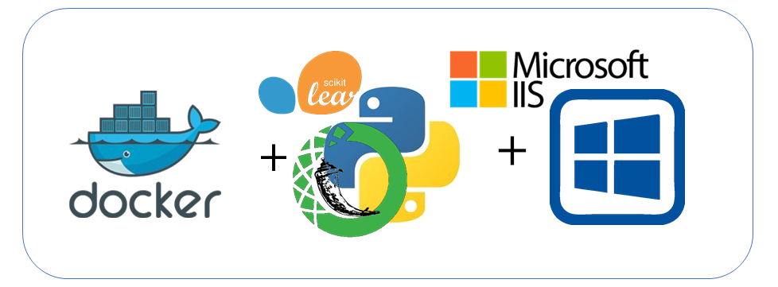

# Python + Flask + wfastcgi + MiniConda + IIS + Swagger

Aplicação em python de exemplo rodando em um contêiner Docker configurado sob o IIS por meio  WFastCGI.

Aplicação conta com a geração de log e a disponibilização de um serviço a fim de verificar o status do aplicativo e todas as configurações do IIS/AppPool para rodar modelos analíticos com bibliotecas suportados pelo Python/Conda/PIP/R.

A aplicação conta também com o uso do Swagger a fim de dispobilizar informações (documentação) das APIs REST da aplicação.

# Pré-requisitos da máquina de desenvolvimento

- Windows 10 Pro/Enterprise (Home Edition não suportado pela Microsoft) ou Windows Server 2019 Version 1803
- Instalação do Docker EE/Docker Desktop conforme procedimento Microsoft (https://docs.microsoft.com/en-us/virtualization/windowscontainers/quick-start/set-up-environment?tabs=Windows-10)
- Instalação do Docker Compose (somente para Windows Server) (https://docs.docker.com/compose/install/)
- Mudando o Docker para "Windows Container" (Docker Desktop)
- Instalação do Github e baixar o projeto (https://desktop.github.com/)

# Setup dos diretório de configuração

- Para setup, copiar todo o conteúdo da pasta *deploy* para o local onde será o destino das configurações do ambiente (**sugestão: D:\Docker\app_base**)
- Modificar o arquivo *docker-compose.yml* para apontar para a pasta destino escolhida.
- Modifique a porta TCP de escuta da aplicação. Default na porta TCP:8000

# Criação da Imagem Docker

Para criação da imagem e execução, favor executar o seguinte comando na raiz do projeto baixado via Github:

    docker-compose build
    docker-compose up -d

Antes de realizar a criação do contêiner, configure o volume para uma pasta em sua máquina.

# Acesso à API REST/documentação da aplicação (Swagger)

Com o container em execução, acesse o seguinte endereço:

    http://<localhost>:8000

# Acesso ao serviço de exempo

Com o container em execução, acesse o seguinte endereço:

    http://<localhost>:8000/app/status
	
# Usuários e Senhas padrão e tokens de acesso

A aplicação possui um usuário padrão que está configurado no arquivo *config.yaml* conforme abaixo:

	username: "app_base"
	password: "pbkdf2:sha256:150000$qLh9iIwH$af3b414d34cf000833d1a4ec734df055a4961d8ca90e63ad2e170bd388183134"
	
	***password plain: (P@ssw0rd)***
	***(no arquivo ele está criptografado com sha256 segundo API PyJWT)***

***É altamente recomendável a troca deste password, e configuração de uma nova hash segundo API PyJWT***

Para utilização de algumas APIs REST a geração de um token é necessário (como API de */deploy*). O token possui uma validade, e após expiração um novo token deve ser gerado.
